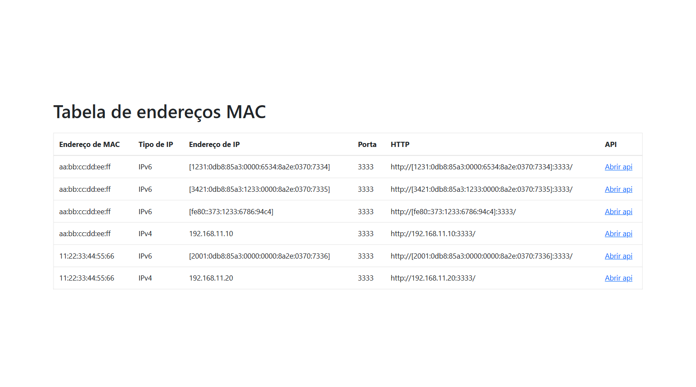
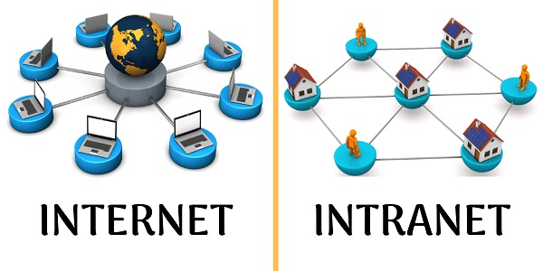

# API Intranet

A API está disponível para ser acessado por qualquer cliente **(celular, desktop, tablet, tv)** que tenha permissão para alcançar o servidor onde a aplicação está sendo executada.

## Introdução
Este é um modelo basico de uma API intranet desenvolvida para fornecer informações sobre endereços MAC e seus respectivos endereços IP dentro de uma rede local. A API foi construída usando Node.js com o framework Express.

## Funcionalidades Principais
- **Listagem de Endereços MAC e IPs:** A API fornece um endpoint para obter uma lista de endereços MAC e seus IPs correspondentes.
- **Visualização em Tabela:** Os dados são apresentados em uma tabela HTML para uma melhor visualização.
- **Geração de PDF (puppeteer):** É possível gerar um PDF com os dados da tabela para facilitar o compartilhamento e armazenamento.



## Configuração
1. Certifique-se de ter o Node.js instalado na sua máquina.
2. Clone o repositório da API Intranet.
3. Instale as dependências utilizando o comando `yarn install` ou `npm install`.
4. Configure as variáveis de ambiente criando um arquivo `.env` na raiz do projeto e definindo a porta desejada (opcional).
5. Inicie o servidor utilizando o comando `yarn dev` ou `npm run dev`.

## Endpoints

### Listagem de Endereços MAC e IPs
- **Endpoint:** `/api/`
- **Método:** GET
- **Descrição:** Retorna uma lista de endereços MAC e seus IPs correspondentes.
- **Exemplo de Resposta:**
```json
{
  "status": 200,
  "mediaAccessControls": {
    "00:00:00:00:00:00": {
      "ips": [
        {
          "name": "IPv4",
          "ip": "192.168.1.10"
        },
        {
          "name": "IPv6",
          "ip": "[fe80::cdef:1234:5678:9abc]"
        }
      ]
    },
    "11:11:11:11:11:11": {
      "ips": [
        {
          "name": "IPv4",
          "ip": "192.168.1.20"
        }
      ]
    }
  },
  "macs": ["00:00:00:00:00:00", "11:11:11:11:11:11"],
  "port": 3333
}
```

## Aplicação Intranet

Uma aplicação intranet é uma plataforma ou sistema de software desenvolvido para ser acessado exclusivamente dentro de uma rede corporativa privada. Diferente da internet, que é acessível publicamente, a intranet é restrita aos usuários e dispositivos conectados à rede interna de uma organização.



Geralmente, uma aplicação intranet oferece uma variedade de funcionalidades e serviços destinados a facilitar a comunicação, colaboração e compartilhamento de recursos entre os membros da organização. Isso pode incluir:

- **Comunicação Interna:** Ferramentas de e-mail, mensagens instantâneas, fóruns de discussão e blogs internos podem ser utilizados para facilitar a comunicação entre os funcionários.

- **Gerenciamento de Documentos:** Armazenamento e compartilhamento de documentos, arquivos e informações importantes da empresa, como políticas, manuais, relatórios e planilhas.

- **Colaboração em Projetos:** Plataformas de colaboração que permitem que equipes trabalhem em projetos compartilhados, com recursos como calendários, tarefas, agendas e ferramentas de acompanhamento de progresso.

- **Recursos Humanos e Autoatendimento:** Portais de RH que permitem que funcionários acessem informações sobre benefícios, folha de pagamento, solicitação de férias, entre outros.

- **Treinamento e Desenvolvimento:** Módulos de treinamento online, cursos e recursos educacionais para o desenvolvimento profissional dos funcionários.

- **Gerenciamento de Ativos e Inventário:** Ferramentas para monitorar e gerenciar ativos físicos, como equipamentos de TI, móveis e materiais de escritório.

Aplicação intranet é uma ferramenta essencial para melhorar a eficiência, a colaboração e a comunicação dentro de uma organização, fornecendo um ambiente seguro e centralizado para acessar informações e recursos corporativos.
